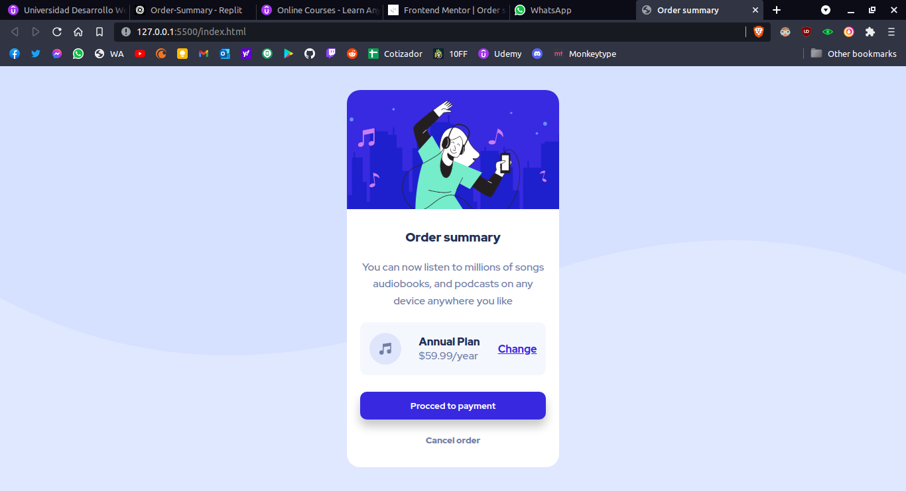

# Frontend Mentor - Order summary card solution

This is a solution to the [Order summary card challenge on Frontend Mentor](https://www.frontendmentor.io/challenges/order-summary-component-QlPmajDUj). This is my first challenge and my first proyect so I'll read all of the comments.

Many of the text in here was writen in spanish. 

## Table of contents

- [Overview](#overview)
  - [The challenge](#the-challenge)
  - [Screenshot](#screenshot)
  - [Links](#links)
- [My process](#my-process)
  - [Built with](#built-with)
  - [What I learned](#what-i-learned)
  - [Continued development](#continued-development)
  - [Useful resources](#useful-resources)
- [Author](#author)
- [Acknowledgments](#acknowledgments)

## Overview

### The challenge

Users should be able to:

- See hover states for interactive elements

### Screenshot


### Links

- Solution URL: [GitHub](https://github.com/jhernar/Order-Summary)
- Live Site URL: [GitHub Pages](https://jhernar.github.io/Order-Summary/)

## My process
I made it with repl.it editor, at first It was hard because I can't dominate at all the syntaxis of css and the elements.
### Built with

- Semantic HTML5 markup
- CSS custom properties
- Flexbox
- CSS Grid
### What I learned

Aprendi a como estructurar el proyecto, que por si mismo es demasiado sencillo para muchos pero para mi que estoy entrando en este proceso si se me complico. Aprendí sobre el flexbox y el grid y sobre las variables en CSS

```html
 <main class="main-container">
      <section class="order-card">
        <article class="order-card__img"></article>
        <article class="order-card__info">
          <h1 class="info__title">Order summary</h1>
          <p class="info__paragraph">
            You can now listen to millions of songs audiobooks, and podcasts on
            any device anywhere you like
          </p>
```

```css
.main-container {
  display: flex;
  justify-content: center;
  align-items: center;
  width: 100vw;
  height: 100vh;
  background-color: var(--pale-blue);
  background-image: url(./images/pattern-background-desktop.svg);
  background-repeat: no-repeat;
}
```

### Continued development

Aun y me haya tardado mucho debido a que tambien me ocupo en mi trabajo, me enfocaré más en CSS ya que es un campo extenso y tiene muchas combinaciones que se pueden hacer con los elementos

## Useful resources

[Boxshadow generator](https://cssgenerator.org/box-shadow-css-generator.html)

[Replit](https://repl.it)


## Author

- Frontend Mentor - [@jhernar](https://www.frontendmentor.io/profile/jhernar)
- Twitter - [@_choysito](https://www.twitter.com/_choysito)

## Acknowledgments

Aprendí mucho en el curso del Ingeniero Ubaldo Acosta y de los desarrolladores de mozilla

[Udemy del curso](https://www.udemy.com/course/universidad-desarrollo-web-moderno-html-css-javascript-html5-css3/?utm_source=adwords&utm_medium=udemyads&utm_campaign=WebDevelopment_v.PROF_la.ES_cc.MX&utm_term=_._ag_120062096563_._ad_512279141247_._kw__._de_c_._dm__._pl__._ti_dsa-1190286609599_._li_9073996_._pd__._&matchtype=) 

[MDN Web Docs](https://developer.mozilla.org/es/)